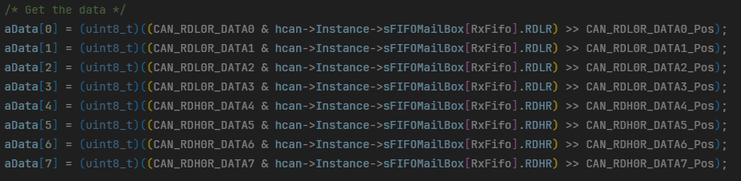
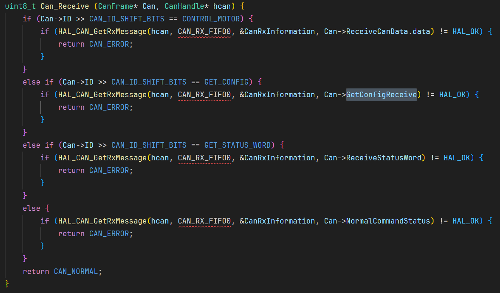
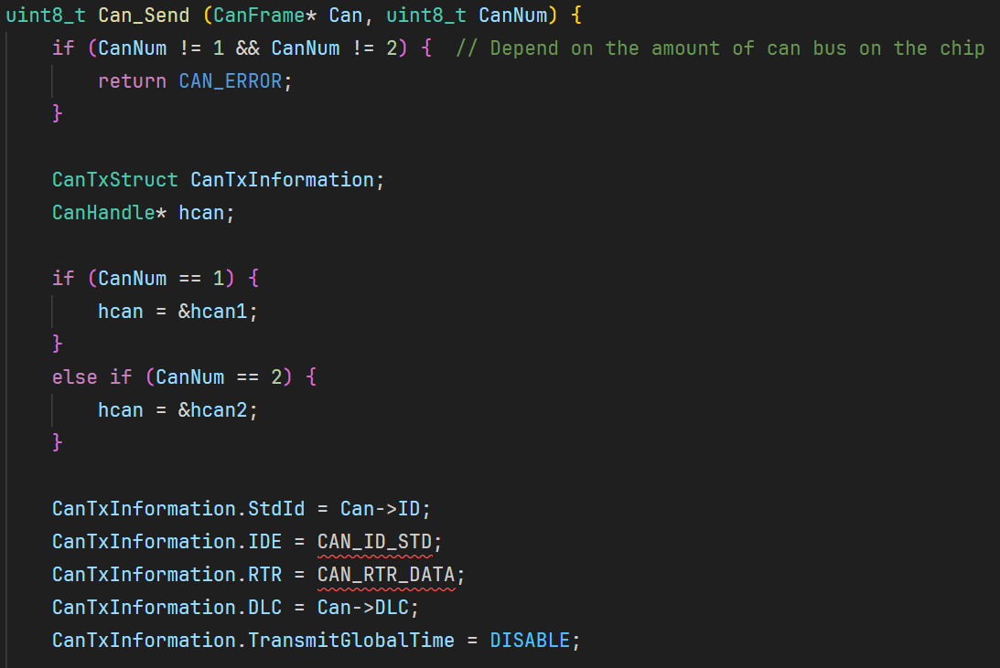

# 版本记录

## Version 1

第一版代码完成。

## Version 2

修改了```AnalyseJ60MotorReceiveData```函数，通过接收到的can通信的ID得到返回数据的电机的ID，从而决定应该解析哪一个电机的数据，而不是将整个电机数组都解析。

## Version 3

增加了电机手册。

## Version 4

1. 由于考虑到各个电机可能挂载在不同的CAN总线上，所以在```MotorInformation```结构体中加入了```CanNum```元素，部分函数增加了CAN总线编号的接口，部分函数的接口直接改成了CAN总线的编号，部分函数内部增加了对CAN总线编号的判断，从而决定发送数据到哪条CAN总线上和从哪条CAN总线上接收数据。
2. 对于比较外层的函数，都添加了指向```MotorInformation```结构体的指针的接口，参考了面向对象编程中的类的思想，也就是用类似于```Class.Method()```的形式调用函数。

## Version 5

1. 在更新到Version 4之后，发现在多个电机的情况下，如果要区分CAN总线编号，则不适合将所有电机的结构体放在同一个数组当中，合理的做法是CAN1总线上的电机和CAN2总线上的电机分别放在不同的数组中。还有一种做法就是不用数组，要用几个电机就初始化多少个结构体，而不是被数组的长度所限制。在提供的例子中采用了CAN1电机和CAN2电机分别放在不同的数组中。（本段中所提到的数组均是```MotorInformation```结构体数组）
2. 修改了```AnalyseJ60MotorReceiveData```函数的接口，因为使用了两个电机结构体的数组，所以将```MotorInformation```的指针作为```AnalyseJ60MotorReceiveData```函数的接口。（其实，```AnalyseJ60MotorReceiveData```函数地具体实现可以有不同，不一定是本例中的形式）

## Version 6

修改了STM32例子中的CAN通信的初始化配置，使得两条CAN总线可以同时工作。

## Version 7

修改了CAN2总线的接收邮箱，改为与CAN1相同。（Version 6中，CAN1和CAN2的接收邮箱不相同，没有收到CAN2总线上的电机的返回值，问题还没找出）

## Version 8

在使用的过程中，发现代码中有着较多的问题，所以这次更新的程度比较大。

下面是两个小的修改：

1. 增加了版本记录。
2. 修改了Version 7中漏改的。修改位置是```Can_Receive```函数

下面的问题是较为严重的问题：

**数组越界问题**：```HAL_CAN_GetRxMessage```函数中有一个形参，是```uint8_t```类型```aData[]```数组。在这个函数中，如下图所示，```aData[]```其实是一个长度至少是8的数组，但是在原有的函数中，发现在调用```HAL_CAN_GetRxMessage```函数的时候，有送进去的数组的长度小于8的情况，这样会导致数组越界，从而访问到数组之外的内存，这时访问到哪里的内存就不得而知了。



**逻辑上的问题**：接收数据的代码有较为严重的逻辑错误。原来的代码如下图所示。



可以看到，原来的代码是通过分析```Can->ID```来决定应该将接收邮箱中的数据放入哪个数组。但是，仔细想想后发现，我不能用```Can->ID```来判断，因为这个```Can->ID```在```Can_Send```函数中用到了，如下图所示。



而且，如果要让这个电机返回数据的话，必须先发送指令给电机。因为```Can->ID```先用在了```Can_Send```发送函数上，所以```Can->ID```表示的是发送时的状态，所以```Can->ID```不能用来分析接收数据表示的状态，应该用接收数据本身来分析。因为这一改变，所以代码有较多的地方都需要修改。逻辑上修改完之后，也清理掉了一些多余的代码。最终的代码可以参考已经上传的最新的代码。怎么修改的也不具体描述了。
